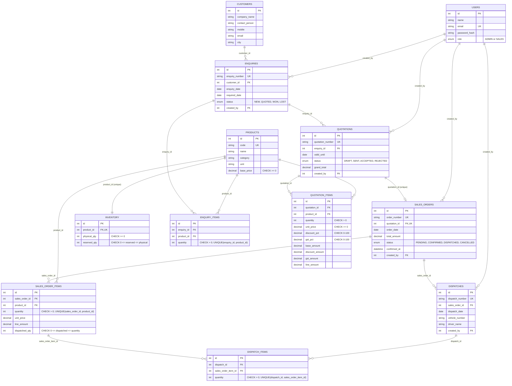

# Database Schema / ER Diagram

12 tables, matching the traceability chain `Customer -> Enquiry -> Quotation -> Sales Order -> Dispatch`, plus a `Product`/`Inventory` pair that every stage references.

## Design notes

- **`inventory.available` is never stored** — it's always `physical_qty - reserved_qty`, computed at read time by the API. Storing a derived value invites it to drift out of sync; computing it guarantees it never can.
- **`sales_orders.quotation_id` is `UNIQUE`**, not just indexed — this makes "one quotation produces one order" a structural guarantee enforced by Postgres itself, not just application logic, so it holds even under a race between two simultaneous convert requests.
- **CHECK constraints are the last line of defence.** `reserved_qty <= physical_qty`, `dispatched_qty <= quantity`, and the various `> 0` / `0-100` bounds are enforced at the database level. Even if a bug slipped past the API's own validation, Postgres would still refuse to store an invalid row.
- **Composite `UNIQUE(parent_id, product_id)`** on every line-item table (`enquiry_items`, `quotation_items`, `sales_order_items`) prevents the same product from silently appearing twice on one document — a second attempt to add it should update the existing line, not create a duplicate.
- **Money uses `DECIMAL(12,2)` / `DECIMAL(5,2)`** throughout, never `FLOAT`, so currency and percentage values never accumulate binary floating-point rounding error.
- **`dispatches.sales_order_id` is deliberately *not* unique** — partial dispatch means one Sales Order can have several dispatch records over time, each covering whatever quantity shipped that day.
